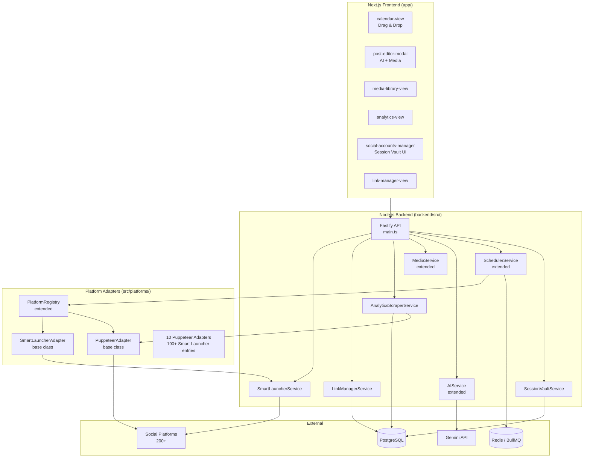

# Social Command Center Pro — Technical Design

## Overview

Social Command Center Pro extends the existing OmniPost Next.js + Node.js application into a full-featured social media command centre supporting 200+ platforms. The core innovation is a **Session Vault** that stores AES-256-GCM-encrypted browser cookies, eliminating the need for developer API keys. Publishing is handled by two complementary mechanisms: a **Puppeteer Automation Engine** for key platforms (full headless automation with anti-ban measures) and a **Smart Launcher** for the remaining 190+ platforms (clipboard-copy + browser open). An **AI Content Engine** adapts tone per platform using the existing Gemini service. Supporting features include a drag-and-drop Content Calendar, Media Library, Analytics Scraper, Link Manager, and Scheduler reliability improvements.

The design integrates with the existing codebase:
- Extends `PlatformRegistry` / `AdapterLoader` in `src/platforms/adapters/`
- Extends `AIService` in `backend/src/services/ai.service.ts`
- Extends `MediaService` in `backend/src/services/media.service.ts`
- Extends `SchedulerService` in `backend/src/services/scheduler.service.ts`
- Adds new routes under `backend/src/routes/`
- Extends the PostgreSQL schema in `backend/src/db/schema.sql`

---

## Architecture



### Key Design Decisions

1. **Cookie-based auth over OAuth**: Most platforms don't offer public OAuth. Storing encrypted session cookies captured via a supervised Puppeteer login flow is the only viable approach for 200+ platform coverage.

2. **Dual adapter strategy**: Puppeteer full automation is reserved for the 10 high-value platforms where DOM automation is well-understood. All others use Smart Launcher (clipboard + browser open) to avoid brittle DOM scraping across hundreds of unknown UIs.

3. **Extend existing PlatformRegistry**: Rather than a separate registry, the existing `PlatformRegistry` class is extended with metadata (adapter type, tone category, char limit, base URL). The `AdapterLoader` gains a `SmartLauncherAdapter` factory.

4. **Reuse existing encryption**: `backend/src/utils/encryption.ts` already implements AES-256-GCM. The Session Vault reuses `encryptToken` / `decryptToken` directly.

5. **BullMQ for scheduler reliability**: The existing `SchedulerService` already uses BullMQ + Redis. We extend it with a startup back-fill sweep and idempotency guards.

---

## Components and Interfaces

### 1. Session Vault

`backend/src/services/session-vault.service.ts`

```typescript
interface CookieEntry {
  name: string;
  value: string;
  domain: string;
  path: string;
  expires?: number;
  httpOnly?: boolean;
  secure?: boolean;
  sameSite?: string;
}

interface VaultEntry {
  id: string;
  userId: string;
  platform: string;
  label: string;           // e.g. "@myhandle"
  encryptedCookies: string; // JSON array of CookieEntry, AES-256-GCM encrypted
  iv: string;
  authTag: string;
  capturedAt: Date;
  lastUsedAt?: Date;
}

interface SessionVaultService {
  // Capture: open supervised Puppeteer session, return captured cookies
  captureSession(userId: string, platform: string): Promise<{ sessionId: string }>;
  // Poll for captured cookies after user completes login
  pollCaptureResult(sessionId: string): Promise<VaultEntry | null>;
  // Store encrypted cookies (called internally after capture)
  storeEntry(userId: string, platform: string, label: string, cookies: CookieEntry[]): Promise<VaultEntry>;
  // Retrieve decrypted cookies for automation use
  getDecryptedCookies(userId: string, platform: string, entryId: string): Promise<CookieEntry[]>;
  // List entries (never returns decrypted values)
  listEntries(userId: string, platform?: string): Promise<Omit<VaultEntry, 'encryptedCookies' | 'iv' | 'authTag'>[]>;
  // Delete entry
  deleteEntry(userId: string, entryId: string): Promise<void>;
}
```

**Per-platform limit enforcement**: `storeEntry` queries `COUNT(*) WHERE user_id = $1 AND platform = $2` before insert; throws if count >= 3.

**Cookie capture flow**:
1. Backend spawns a Puppeteer browser with `headless: false` (visible to user)
2. Navigates to `platformRegistry.get(platform).loginUrl`
3. Polls `page.cookies()` every 2 seconds for up to 5 minutes
4. When session cookies appear (platform-specific detection heuristic), captures and encrypts them
5. Closes browser, stores entry, notifies frontend via SSE or polling endpoint

### 2. Platform Registry (Extended)

`src/platforms/adapters/PlatformRegistry.ts` — extended with metadata:

```typescript
interface PlatformConfig {
  id: string;
  displayName: string;
  baseUrl: string;
  loginUrl: string;
  postUrl: string;
  adapterType: 'puppeteer' | 'smart_launcher';
  toneCategory: 'professional' | 'casual' | 'provocative' | 'crypto' | 'forum' | 'short_form';
  charLimit?: number;
  category: 'standard_social' | 'adult' | 'crypto_nostr' | 'forums' | 'creator_economy';
  supportsHashtags: boolean;
}

// Extended PlatformRegistry
class PlatformRegistry {
  private adapters: Map<string, PlatformAdapter>;
  private configs: Map<string, PlatformConfig>;  // NEW

  registerConfig(config: PlatformConfig): void;
  getConfig(platformId: string): PlatformConfig | undefined;
  listByCategory(category: string): PlatformConfig[];
  listAll(): PlatformConfig[];
  validateConfig(config: PlatformConfig): { valid: boolean; errors: string[] };
}
```

Platform configs are loaded from `src/platforms/registry.json` (a static JSON file checked into source) at startup. Dynamic additions go through `validateConfig` before `registerConfig`.

### 3. Puppeteer Automation Engine

`src/platforms/adapters/base/PuppeteerAdapter.ts` — new abstract base class:

```typescript
abstract class PuppeteerAdapter extends BaseAdapter {
  protected antiBan: AntiBanSystem;

  // Template method: subclasses implement platform-specific steps
  async publish(post: Post): Promise<PublishResult>;

  protected abstract navigateToPostPage(page: Page): Promise<void>;
  protected abstract fillPostContent(page: Page, post: Post): Promise<void>;
  protected abstract submitPost(page: Page): Promise<{ postId: string; postUrl: string }>;
  protected abstract detectLoginChallenge(page: Page): Promise<boolean>;

  // Shared: restore cookies, close browser
  private async restoreCookies(page: Page, cookies: CookieEntry[]): Promise<void>;
  private async closeBrowser(browser: Browser): Promise<void>;
}
```

**Browser lifecycle**: Each publish attempt creates a fresh `puppeteer.launch()` instance. The browser is closed in a `finally` block with a 30-second timeout enforced via `Promise.race`.

### 4. Anti-Ban System

`src/platforms/adapters/base/AntiBanSystem.ts`:

```typescript
class AntiBanSystem {
  // Type text with randomised per-keystroke delay [800ms, 4000ms]
  async humanType(page: Page, selector: string, text: string): Promise<void>;

  // Move mouse along a Bézier curve before clicking
  async humanClick(page: Page, selector: string): Promise<void>;

  // Return shuffled field order (for fields where order is irrelevant)
  shuffleFieldOrder<T>(fields: T[]): T[];

  // Rotate User-Agent from pool of 10+ realistic strings
  getRandomUserAgent(): string;

  // Check rate window; returns required cool-down ms (0 if none needed)
  checkCoolDown(platform: string, userId: string): Promise<number>;

  // Record a publish event for rate tracking
  recordPublish(platform: string, userId: string): Promise<void>;
}
```

Rate window tracking is stored in Redis: `anti_ban:{userId}:{platform}` as a sorted set of timestamps. The cool-down check counts entries in the last 3600 seconds; if > 5, returns `1800000` (30 min).

### 5. Smart Launcher

`backend/src/services/smart-launcher.service.ts`:

```typescript
interface LaunchResult {
  platform: string;
  status: 'launched';
  message: string;
}

class SmartLauncherService {
  // Copy content to clipboard and open browser tab
  async launch(post: Post, platformId: string): Promise<LaunchResult>;

  // Process multiple platforms sequentially with 3s delay
  async launchMultiple(post: Post, platformIds: string[]): Promise<LaunchResult[]>;
}
```

Clipboard write uses `clipboardy` (cross-platform). Browser open uses `open` package. Both are lightweight Node.js packages with no native dependencies.

### 6. AI Content Engine (Extended)

Extends `AIService` in `backend/src/services/ai.service.ts`:

```typescript
interface ToneProfile {
  name: string;
  platforms: string[];
  systemPrompt: string;
  exampleStyle: string;
}

const TONE_PROFILES: Record<string, ToneProfile> = {
  professional: { platforms: ['linkedin', 'polywork'], ... },
  casual:       { platforms: ['facebook', 'instagram', 'threads'], ... },
  provocative:  { platforms: ['onlyfans', 'fansly', 'fancentro'], ... },
  crypto:       { platforms: ['nostr', 'farcaster', 'lens'], ... },
  forum:        { platforms: ['reddit', 'discourse', 'lemmy'], ... },
  short_form:   { platforms: ['twitter', 'bluesky', 'mastodon'], ... },
};

// New method added to AIService:
async generatePlatformVariants(
  baseContent: string,
  targetPlatforms: string[],
  options?: { timeoutMs?: number }
): Promise<PlatformVariant[]>;

interface PlatformVariant {
  platformId: string;
  content: string;
  hashtags: string[];
  charCount: number;
  toneProfile: string;
}
```

Each variant is generated with a 15-second per-platform timeout using the existing `requestWithTimeout` helper. On failure, the original `baseContent` is returned unchanged for that platform.

### 7. Drag-and-Drop Content Calendar

Extends `app/components/calendar-view.tsx`. The existing component is enhanced with:

- **DnD library**: `@dnd-kit/core` + `@dnd-kit/sortable` (already common in Next.js projects, no Electron dependency)
- **Drag source**: Each post card becomes a `<Draggable>` with `postId` as data
- **Drop target**: Each calendar cell becomes a `<Droppable>` with `{ date, time }` as data
- **On drop**: Calls `PATCH /api/posts/:id` with `{ scheduledAt: newDateTime }`; optimistic UI update with rollback on error
- **Out-of-window warning**: Drop targets outside configured publishing windows render with a yellow border; a confirmation dialog fires before the API call

New API endpoint: `PATCH /api/posts/:id/reschedule` — accepts `{ scheduledAt: ISO8601 }`, validates, calls `schedulerService.reschedulePost`.

### 8. Media Library

Extends `MediaService`. New capabilities:

- **Formats**: Adds GIF and WebP to existing JPEG/PNG/MP4/MOV support
- **Size limit**: Raised to 500 MB (from 10 MB image / 1 GB video — unified cap)
- **Thumbnail for video**: Uses `fluent-ffmpeg` to extract frame at 1 second
- **Search/filter**: New `listMedia(userId, { type?, search?, page?, limit? })` method
- **Post attachment**: `attachMediaToPost(postId, mediaId)` — inserts into `post_media` join table without re-uploading
- **Cascade delete**: `deleteMedia` checks `post_media` for unpublished posts, returns `affectedPosts[]` before deleting

New view component: `app/components/media-library-view.tsx` — grid layout with filter bar.

### 9. Analytics Scraper

`backend/src/services/analytics-scraper.service.ts`:

```typescript
class AnalyticsScraperService {
  // Triggered by scheduler 1 hour after post publication
  async scrapePost(postId: string, platform: string): Promise<AnalyticsSnapshot>;

  // Uses PuppeteerAdapter infrastructure + session cookies
  private async scrapeWithSession(url: string, cookies: CookieEntry[]): Promise<RawMetrics>;

  // Mark as unavailable after 3 failures
  private async handleFailure(postId: string, platform: string): Promise<void>;
}

interface AnalyticsSnapshot {
  postId: string;
  platform: string;
  likes: number;
  comments: number;
  shares: number;
  views: number;
  scrapedAt: Date;
}
```

Scraping is rate-limited to one request per platform per 30 minutes using a Redis key `analytics_scrape:{platform}:{userId}` with TTL 1800.

### 10. Link Manager

`backend/src/services/link-manager.service.ts`:

```typescript
class LinkManagerService {
  // Shorten URL to internal redirect: /r/{slug}
  async shortenUrl(userId: string, originalUrl: string, customAlias?: string): Promise<TrackedLink>;

  // Record click event
  async recordClick(slug: string, metadata: ClickMetadata): Promise<void>;

  // Get link stats
  async getLinkStats(userId: string, linkId: string): Promise<LinkStats>;
}

interface TrackedLink {
  id: string;
  userId: string;
  slug: string;          // auto-generated or custom alias
  originalUrl: string;
  clickCount: number;
  createdAt: Date;
}
```

The redirect endpoint `GET /r/:slug` is registered in Fastify, looks up the slug, increments click count, and issues a 302 redirect. Custom alias validation: `/^[a-zA-Z0-9-]{1,50}$/`.

---

## Data Models

### New / Extended Tables

```sql
-- Session Vault
CREATE TABLE session_vault (
  id          UUID PRIMARY KEY DEFAULT gen_random_uuid(),
  user_id     INTEGER NOT NULL REFERENCES users(id) ON DELETE CASCADE,
  platform    VARCHAR(64) NOT NULL,
  label       VARCHAR(128) NOT NULL,
  encrypted_cookies TEXT NOT NULL,
  iv          VARCHAR(64) NOT NULL,
  auth_tag    VARCHAR(64) NOT NULL,
  captured_at TIMESTAMPTZ NOT NULL DEFAULT NOW(),
  last_used_at TIMESTAMPTZ,
  CONSTRAINT max_3_per_platform UNIQUE (user_id, platform, label)
);
CREATE INDEX idx_vault_user_platform ON session_vault(user_id, platform);

-- Platform Registry (persisted configs for dynamic additions)
CREATE TABLE platform_configs (
  id              VARCHAR(64) PRIMARY KEY,
  display_name    VARCHAR(128) NOT NULL,
  base_url        VARCHAR(512) NOT NULL,
  login_url       VARCHAR(512) NOT NULL,
  post_url        VARCHAR(512) NOT NULL,
  adapter_type    VARCHAR(32) NOT NULL CHECK (adapter_type IN ('puppeteer','smart_launcher')),
  tone_category   VARCHAR(32) NOT NULL,
  char_limit      INTEGER,
  category        VARCHAR(64) NOT NULL,
  supports_hashtags BOOLEAN NOT NULL DEFAULT TRUE,
  is_active       BOOLEAN NOT NULL DEFAULT TRUE,
  created_at      TIMESTAMPTZ NOT NULL DEFAULT NOW()
);

-- Anti-ban publish log (also tracked in Redis for speed)
CREATE TABLE publish_log (
  id          UUID PRIMARY KEY DEFAULT gen_random_uuid(),
  user_id     INTEGER NOT NULL REFERENCES users(id) ON DELETE CASCADE,
  platform    VARCHAR(64) NOT NULL,
  post_id     UUID,
  published_at TIMESTAMPTZ NOT NULL DEFAULT NOW()
);
CREATE INDEX idx_publish_log_user_platform_time ON publish_log(user_id, platform, published_at);

-- Extend posts table
ALTER TABLE posts
  ADD COLUMN IF NOT EXISTS platform_variants  JSONB,   -- {platformId: {content, hashtags}}
  ADD COLUMN IF NOT EXISTS platform_post_ids  JSONB,   -- {platformId: externalId}
  ADD COLUMN IF NOT EXISTS platform_urls      JSONB,   -- {platformId: url}
  ADD COLUMN IF NOT EXISTS analytics_status   VARCHAR(32) DEFAULT 'pending',
  ADD COLUMN IF NOT EXISTS retry_count        INTEGER DEFAULT 0,
  ADD COLUMN IF NOT EXISTS errors             JSONB;

-- Extend post_status enum
ALTER TYPE post_status ADD VALUE IF NOT EXISTS 'publishing';
ALTER TYPE post_status ADD VALUE IF NOT EXISTS 'posted';
ALTER TYPE post_status ADD VALUE IF NOT EXISTS 'failed';
ALTER TYPE post_status ADD VALUE IF NOT EXISTS 'launched';

-- Media Library (extends existing media table)
ALTER TABLE media
  ADD COLUMN IF NOT EXISTS tags       TEXT[],
  ADD COLUMN IF NOT EXISTS folder     VARCHAR(128);

-- Analytics snapshots
CREATE TABLE analytics_snapshots (
  id          UUID PRIMARY KEY DEFAULT gen_random_uuid(),
  post_id     UUID NOT NULL,
  platform    VARCHAR(64) NOT NULL,
  likes       INTEGER NOT NULL DEFAULT 0,
  comments    INTEGER NOT NULL DEFAULT 0,
  shares      INTEGER NOT NULL DEFAULT 0,
  views       INTEGER NOT NULL DEFAULT 0,
  scraped_at  TIMESTAMPTZ NOT NULL DEFAULT NOW(),
  scrape_attempts INTEGER NOT NULL DEFAULT 1
);
CREATE INDEX idx_analytics_post_platform ON analytics_snapshots(post_id, platform);

-- Link Manager
CREATE TABLE tracked_links (
  id           UUID PRIMARY KEY DEFAULT gen_random_uuid(),
  user_id      INTEGER NOT NULL REFERENCES users(id) ON DELETE CASCADE,
  slug         VARCHAR(50) UNIQUE NOT NULL,
  original_url TEXT NOT NULL,
  click_count  INTEGER NOT NULL DEFAULT 0,
  created_at   TIMESTAMPTZ NOT NULL DEFAULT NOW()
);

CREATE TABLE link_clicks (
  id         UUID PRIMARY KEY DEFAULT gen_random_uuid(),
  link_id    UUID NOT NULL REFERENCES tracked_links(id) ON DELETE CASCADE,
  clicked_at TIMESTAMPTZ NOT NULL DEFAULT NOW(),
  user_agent TEXT,
  referrer   TEXT,
  ip_hash    VARCHAR(64)  -- hashed for privacy
);
CREATE INDEX idx_link_clicks_link_id ON link_clicks(link_id);
```

### Post Object (TypeScript)

```typescript
interface Post {
  id: string;
  userId: string;
  title?: string;
  baseContent: string;
  platformVariants: Record<string, PlatformVariant>;
  mediaIds: string[];
  targetPlatforms: string[];
  scheduledAt?: Date;
  status: 'draft' | 'scheduled' | 'publishing' | 'posted' | 'failed' | 'launched';
  platformPostIds: Record<string, string>;
  platformUrls: Record<string, string>;
  analyticsStatus: 'pending' | 'available' | 'unavailable';
  retryCount: number;
  errors: Record<string, { message: string; code?: string; timestamp: string }>;
  createdAt: Date;
  updatedAt: Date;
}
```

---

## Correctness Properties

*A property is a characteristic or behavior that should hold true across all valid executions of a system — essentially, a formal statement about what the system should do. Properties serve as the bridge between human-readable specifications and machine-verifiable correctness guarantees.*

### Property 1: Cookie Encryption Round Trip

*For any* valid array of `CookieEntry` objects, encrypting them and then decrypting the result should produce an array equivalent to the original.

**Validates: Requirements 1.1, 1.6**

---

### Property 2: Per-Platform Vault Limit

*For any* user and platform, the number of `VaultEntry` records stored in the Session Vault for that (user, platform) pair shall never exceed 3.

**Validates: Requirements 1.2, 1.3**

---

### Property 3: Platform Config Validation Invariant

*For any* platform config object, calling `validateConfig` with a missing or empty `id`, `displayName`, or `baseUrl` field shall return `valid: false`.

**Validates: Requirements 2.4**

---

### Property 4: AI Variant Character Limit

*For any* platform with a defined `charLimit` and any base content string, the generated platform variant's `content` field shall have a character count ≤ `charLimit`.

**Validates: Requirements 6.3**

---

### Property 5: AI Fallback on Failure

*For any* platform variant generation that times out or errors, the returned variant's `content` shall equal the original `baseContent` passed to `generatePlatformVariants`.

**Validates: Requirements 6.6**

---

### Property 6: Hashtag Count Bounds

*For any* post content and target platform that supports hashtags, the hashtag suggestion list returned by the AI Engine shall contain between 5 and 15 entries inclusive.

**Validates: Requirements 6.7, 7.1**

---

### Property 7: Post Serialisation Round Trip

*For any* valid `Post` object (including Unicode, emoji, and special characters), serialising to JSON and deserialising back shall produce a `Post` object with all fields equal to the original.

**Validates: Requirements 12.1, 12.2, 12.3, 12.4**

---

### Property 8: Adapter Interface Invariant

*For any* registered `PlatformAdapter`, calling `validateContent` with a `Post` whose `content` is empty or whitespace-only shall return `{ valid: false }`.

**Validates: Requirements 15.4**

---

### Property 9: Smart Launcher Sequential Delay

*For any* list of N Smart Launcher platforms (N > 1), the total elapsed time for `launchMultiple` shall be at least `(N - 1) * 3000` milliseconds.

**Validates: Requirements 4.4**

---

### Property 10: Analytics Scrape Rate Limit

*For any* (user, platform) pair, the Analytics Scraper shall not issue more than one scrape request to that platform within any 30-minute window.

**Validates: Requirements 10.5**

---

### Property 11: Link Slug Uniqueness

*For any* two distinct tracked links belonging to the same or different users, their `slug` values shall be different.

**Validates: Requirements 11.1, 11.5**

---

### Property 12: Custom Alias Format

*For any* custom alias string, `LinkManagerService.shortenUrl` shall reject aliases that contain characters outside `[a-zA-Z0-9-]` or exceed 50 characters.

**Validates: Requirements 11.4**

---

### Property 13: Scheduler Back-Fill Window

*For any* post whose `scheduledAt` is within the past 24 hours and whose status is `scheduled`, the Scheduler shall process it on startup.

**Validates: Requirements 13.2**

---

### Property 14: Anti-Ban Cool-Down Enforcement

*For any* (user, platform) pair where more than 5 posts have been published within the last 60 minutes, `AntiBanSystem.checkCoolDown` shall return a value ≥ 1,800,000 ms.

**Validates: Requirements 5.4**

---

## Error Handling

| Scenario | Component | Behaviour |
|---|---|---|
| Cookie capture timeout (5 min) | SessionVaultService | Close browser, return `{ error: 'capture_timeout' }` to client |
| Malformed/empty cookies captured | SessionVaultService | Discard entry, notify user via API response |
| Vault limit exceeded (>3 per platform) | SessionVaultService | HTTP 409, message: "Per-platform limit of 3 sessions reached" |
| CAPTCHA / login challenge detected | PuppeteerAdapter | Abort, set post status `failed`, notify user |
| Puppeteer publish failure | SchedulerService | Retry up to 3× with delays 60s / 300s / 900s (exponential back-off) |
| Browser not closed within 30s | PuppeteerAdapter | `Promise.race` timeout kills browser process |
| AI generation timeout (15s) | AIService | Return original `baseContent` for that platform, log warning |
| Analytics scrape failure ×3 | AnalyticsScraperService | Set `analytics_status = 'unavailable'`, stop retrying |
| Duplicate link slug | LinkManagerService | HTTP 409, message: "Alias already in use" |
| Invalid custom alias format | LinkManagerService | HTTP 400, message: "Alias must match [a-zA-Z0-9-]{1,50}" |
| Media file > 500 MB | MediaService | HTTP 413, message: "File exceeds 500 MB limit" |
| Post dropped outside publishing window | calendar-view | Show warning overlay; require explicit confirmation dialog |
| JWT expired | auth middleware | HTTP 401; client redirects to login |

---

## Testing Strategy

### Unit Tests

Focus on specific examples, edge cases, and pure-function logic:

- `SessionVaultService`: vault limit enforcement (exactly 3 allowed, 4th rejected), cookie validation (empty array rejected, malformed JSON rejected)
- `AntiBanSystem`: `checkCoolDown` returns 0 when < 5 posts, ≥ 1800000 when > 5 posts
- `LinkManagerService`: alias regex validation, slug collision detection
- `AIService.generatePlatformVariants`: fallback returns original content on timeout
- `PlatformRegistry.validateConfig`: rejects configs with missing required fields
- `AnalyticsScraperService`: marks `unavailable` after 3 failures

### Property-Based Tests

Use **fast-check** (TypeScript-native PBT library) with minimum 100 iterations per property.

Each test is tagged with a comment in the format:
`// Feature: social-command-center-pro, Property N: <property_text>`

| Property | Test Description | Generator |
|---|---|---|
| P1: Cookie round trip | Arbitrary `CookieEntry[]` → encrypt → decrypt → equals original | `fc.array(fc.record({name: fc.string(), value: fc.string(), domain: fc.string(), path: fc.string()}))` |
| P2: Vault limit | Generate up to 10 store attempts for same (user, platform); count in DB never exceeds 3 | `fc.integer({min:1, max:10})` |
| P3: Config validation | Arbitrary config with one required field blanked → `valid: false` | `fc.record(...)` with `fc.oneof(fc.constant(''), fc.string())` |
| P4: AI char limit | Arbitrary base content + platform with charLimit → variant.content.length ≤ charLimit | `fc.string()` + platform from registry |
| P5: AI fallback | Simulate timeout for arbitrary platform → returned content equals input | `fc.string()` |
| P6: Hashtag bounds | Arbitrary post content → hashtag count in [5, 15] | `fc.string({minLength: 10})` |
| P7: Post round trip | Arbitrary Post with Unicode/emoji → JSON.stringify → JSON.parse → deep equal | `fc.record(...)` with `fc.fullUnicodeString()` |
| P8: Adapter invariant | Arbitrary whitespace-only string as content → `validateContent` returns `valid: false` | `fc.stringOf(fc.constantFrom(' ', '\t', '\n'))` |
| P9: Smart Launcher delay | Arbitrary list of N > 1 platforms → elapsed time ≥ (N-1) * 3000ms | `fc.array(fc.string(), {minLength: 2, maxLength: 10})` |
| P10: Analytics rate limit | Arbitrary sequence of scrape calls → no two within 30 min for same (user, platform) | `fc.array(fc.record({userId: fc.integer(), platform: fc.string()}))` |
| P11: Slug uniqueness | Generate N links → all slugs distinct | `fc.integer({min: 2, max: 50})` |
| P12: Alias format | Arbitrary string → rejected iff contains non-`[a-zA-Z0-9-]` or length > 50 | `fc.string()` |
| P13: Scheduler back-fill | Arbitrary posts with scheduledAt in past 24h → all processed on startup | `fc.array(fc.date({min: new Date(Date.now()-86400000), max: new Date()}))` |
| P14: Anti-ban cool-down | Generate > 5 publish events in 1h window → checkCoolDown ≥ 1800000 | `fc.integer({min: 6, max: 20})` |

**Configuration**: Each `fc.assert(fc.property(...))` call uses `{ numRuns: 100 }` minimum. Tests live in `scripts/tests/` alongside existing adapter tests.

---

## API Endpoints

All endpoints (except `/r/:slug` and `/api/auth/*`) require `Authorization: Bearer <jwt>`.

### Session Vault
| Method | Path | Description |
|---|---|---|
| `POST` | `/api/vault/capture` | Start supervised Puppeteer login session; returns `{ sessionId }` |
| `GET` | `/api/vault/capture/:sessionId` | Poll for capture result |
| `GET` | `/api/vault` | List vault entries (no decrypted values) |
| `DELETE` | `/api/vault/:entryId` | Delete vault entry |

### Platform Registry
| Method | Path | Description |
|---|---|---|
| `GET` | `/api/platforms` | List all platform configs grouped by category |
| `POST` | `/api/platforms` | Add new platform config (validates required fields) |
| `PATCH` | `/api/platforms/:id` | Update platform config |

### Posts & Scheduling
| Method | Path | Description |
|---|---|---|
| `GET` | `/api/posts` | List posts (filter by status, platform, date range) |
| `POST` | `/api/posts` | Create post |
| `PATCH` | `/api/posts/:id` | Update post |
| `DELETE` | `/api/posts/:id` | Delete post |
| `PATCH` | `/api/posts/:id/reschedule` | Reschedule post `{ scheduledAt: ISO8601 }` |
| `POST` | `/api/posts/:id/publish` | Trigger immediate publish |

### AI Content Engine
| Method | Path | Description |
|---|---|---|
| `POST` | `/api/ai/variants` | Generate platform variants `{ baseContent, platforms[] }` |
| `POST` | `/api/ai/hashtags` | Generate hashtags `{ content, platform }` |
| `POST` | `/api/ai/caption` | Generate caption (existing endpoint, extended) |

### Media Library
| Method | Path | Description |
|---|---|---|
| `GET` | `/api/media` | List media (filter by type, search, page) |
| `POST` | `/api/media/upload` | Upload media file (multipart) |
| `DELETE` | `/api/media/:id` | Delete media asset |
| `POST` | `/api/media/:id/attach` | Attach media to post `{ postId }` |

### Analytics
| Method | Path | Description |
|---|---|---|
| `GET` | `/api/analytics` | Aggregated analytics per platform |
| `GET` | `/api/analytics/posts/:id` | Analytics snapshots for a specific post |
| `POST` | `/api/analytics/scrape/:postId` | Trigger manual analytics scrape |

### Link Manager
| Method | Path | Description |
|---|---|---|
| `GET` | `/api/links` | List tracked links |
| `POST` | `/api/links` | Create tracked link `{ originalUrl, customAlias? }` |
| `GET` | `/api/links/:id/stats` | Get click stats for a link |
| `DELETE` | `/api/links/:id` | Delete tracked link |
| `GET` | `/r/:slug` | Redirect endpoint (no auth required) |
