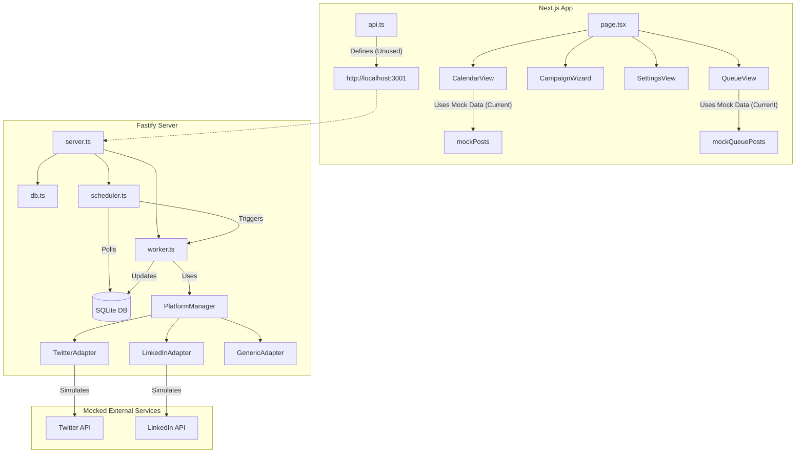

# Dependencies Graph

## Data Flow Analysis

1.  **Frontend State**: Isolated. Components rely on local state and hardcoded mock objects.
2.  **Backend State**: Persistent. SQLite database stores posts, platforms, and settings.
3.  **Gap**: The `api.ts` file exists and matches the backend endpoints, but the UI components are not importing or using these API functions yet.
